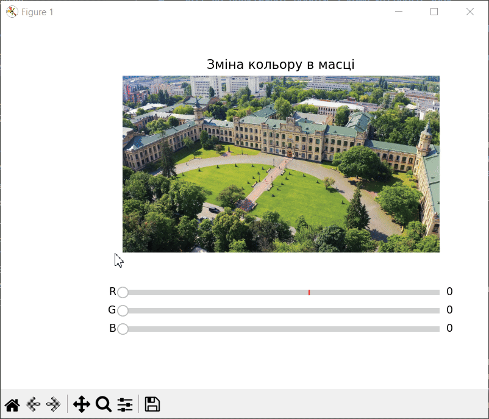

<div style="text-align:center; margin-top: 1cm;">
    <h2>Київський політехнічний інститут імені Ігоря Сікорського</h2>
    <h2>Приладобудівний факультет</h2>
    <h3>Кафедра автоматизації та систем неруйнівного контролю</h3>
    <br><br><br>
</div>

<div style="text-align:center; margin-top: 5cm;">
    <h2>Практична робота №1 </h2>
    <h2>з предмету "Комп'ютерний зір"</h2>
</div>

<div style="text-align:right; margin-top: 5cm;">
<p>Студент: Погорєлов Богдан<br>
    Група: ПК-51мп<br>
</p>
</div>
<div style="text-align:center; margin-top: 5cm;">
2025 рік  <br><br><br><br>
</div>

### **Тема:** Створення інтерактивного редактора для зміни кольору в заданій області зображення з використанням маски

### **Мета роботи**

Основною метою цієї роботи було застосування об'єктно-орієнтованого підходу для створення гнучкого інструменту обробки зображень. Завдання полягали в наступному:
1.  Розробити клас `ColorMaskEditor`, що інкапсулює логіку роботи з зображеннями та відеопотоками.
2.  Навчитися створювати та застосовувати бінарні маски для виділення та обробки конкретної області інтересу (Region of Interest, ROI).
3.  Порівняти два підходи до обробки пікселів: **векторизований** (швидкий, з використанням функцій OpenCV) та **попіксельний** (повільний, з використанням циклів Python).
4.  Створити інтерактивний інтерфейс за допомогою бібліотеки `Matplotlib` та її віджетів (`Slider`) для керування параметрами обробки в реальному часі.



### **Опис коду**

Скрипт реалізовано у вигляді класу `ColorMaskEditor`, який дозволяє накладати колірний фільтр на круглу область в центрі зображення або відеокадру.

#### **Структура класу `ColorMaskEditor`:**

* **`__init__(self, source, init_color)`**: Конструктор класу. Він приймає джерело (`source`), яке може бути шляхом до файлу або індексом вебкамери. Під час ініціалізації завантажується зображення/відеопотік та створюється бінарна маска у вигляді білого кола на чорному фоні.
* **`apply_color(self, frame, color)`**: **Ефективний** метод накладання кольору. Він використовує вбудовану функцію `cv2.add` з маскою, що дозволяє застосувати операцію додавання кольору лише до пікселів, що належать до білої області маски. Це векторизована операція, яка виконується дуже швидко.
* **`apply_color_slow(self, frame, color)`**: **Навчальний** (повільний) метод, що виконує те ж саме завдання, але за допомогою вкладених циклів `for`, перебираючи кожен піксель зображення. Цей метод був створений для демонстрації величезної різниці у продуктивності порівняно з векторизованим підходом.
* **`run_image_mode(self)`**: Режим роботи зі статичним зображенням. Він створює вікно за допомогою `Matplotlib`, де відображається зображення та три повзунки (sliders) для каналів R, G, B. При зміні положення повзунка колір у центральній області зображення динамічно оновлюється.
* **`run_video_mode(self)`**: Режим роботи з відеопотоком (наприклад, з вебкамери). Колір в масці можна змінювати за допомогою клавіш `r`, `g`, `b`, а вихід здійснюється клавішею `q`.

При запуску скрипта створюється екземпляр класу `ColorMaskEditor` для зображення `kpi.jpg` та запускається режим `run_image_mode`.


### **Результат виконання**

Після запуску програми з'являється вікно `Matplotlib`, що містить вихідне зображення, в центрі якого на круглу область накладено колірний фільтр. Нижче розташовані три повзунки, що відповідають за інтенсивність червоного, зеленого та синього каналів доданого кольору.


Переміщення повзунків дозволяє інтерактивно та плавно змінювати відтінок і яскравість фільтра в реальному часі, що наочно демонструє роботу алгоритму.

### **Висновок**

У ході виконання цієї практичної роботи я успішно реалізував інтерактивний застосунок, використовуючи об'єктно-орієнтований підхід. Я здобув важливі практичні навички:

1.  **Інкапсуляція логіки**: Створення класу дозволило зробити код більш структурованим, гнучким та легким для повторного використання.
2.  **Робота з масками**: Я зрозумів, як створювати та ефективно застосовувати маски для обробки лише необхідних частин зображення (ROI).
3.  **Порівняння продуктивності**: Практично переконався у критичній перевазі векторизованих операцій OpenCV/NumPy над ручним перебором пікселів у циклах Python. Це ключове знання для написання ефективного коду в комп'ютерному зорі.
4.  **Створення GUI**: Я отримав досвід інтеграції OpenCV з `Matplotlib` для створення простих графічних інтерфейсів з інтерактивними елементами, що значно покращує зручність користування програмою.

``` python
import cv2
import numpy as np
import matplotlib.pyplot as plt
from matplotlib.widgets import Slider

class ColorMaskEditor:
    def __init__(self, source="kpi.jpg", init_color=(0, 0, 150)):
        """
        source : шлях до зображення або int (наприклад, 0 для вебкамери)
        init_color : початковий колір (BGR)
        """
        self.source = source
        self.init_color = init_color

        # Завантаження зображення або підготовка відеопотоку
        if isinstance(source, str):
            self.img = cv2.imread(source)
            if self.img is None:
                raise ValueError(f"Не вдалося відкрити файл: {source}")
            self.h, self.w, _ = self.img.shape
        else:
            self.cap = cv2.VideoCapture(source)
            if not self.cap.isOpened():
                raise ValueError("Не вдалося відкрити відеопотік")
            ret, frame = self.cap.read()
            if not ret:
                raise ValueError("Не вдалося зчитати кадр із відеопотоку")
            self.img = frame
            self.h, self.w, _ = frame.shape

        # Центр і радіус кола
        self.cx, self.cy = self.w // 2, self.h // 2
        self.r = min(self.h, self.w) // 4

        # Маска
        self.mask = np.zeros((self.h, self.w), dtype=np.uint8)
        cv2.circle(self.mask, (self.cx, self.cy), self.r, 255, -1)

    def apply_color(self, frame, color):
        color_layer = np.zeros_like(frame, dtype=np.uint8)
        color_layer[:] = color
        added = cv2.add(frame, color_layer, mask=self.mask)
        return np.where(self.mask[:, :, None] == 255, added, frame)

    def apply_color_slow(self, frame, color):
        # гарантія, що color завжди в межах [0, 255]
        color = np.clip(color, 0, 255).astype(np.int16)

        added = frame.copy().astype(np.int16)  # уникнення переповнення
        for y in range(self.h):
            for x in range(self.w):
                if (x - self.cx) ** 2 + (y - self.cy) ** 2 <= self.r ** 2:
                    for c in range(3):  # BGR
                        added[y, x, c] = np.clip(added[y, x, c] + color[c], 0, 255)
        return added.astype(np.uint8)


    def run_image_mode(self):
        fig, ax = plt.subplots()
        plt.subplots_adjust(left=0.25, bottom=0.35)

        current_img = self.apply_color(self.img, self.init_color)
        im = ax.imshow(cv2.cvtColor(current_img, cv2.COLOR_BGR2RGB))
        ax.set_title("Зміна кольору в масці")
        ax.axis("off")

        # Слайдери
        ax_r = plt.axes([0.25, 0.25, 0.65, 0.03])
        ax_g = plt.axes([0.25, 0.20, 0.65, 0.03])
        ax_b = plt.axes([0.25, 0.15, 0.65, 0.03])

        s_r = Slider(ax_r, 'R', 0, 255, valinit=self.init_color[2], valstep=1)
        s_g = Slider(ax_g, 'G', 0, 255, valinit=self.init_color[1], valstep=1)
        s_b = Slider(ax_b, 'B', 0, 255, valinit=self.init_color[0], valstep=1)

        def update(val):
            color = (int(s_b.val), int(s_g.val), int(s_r.val))  # BGR
            new_img = self.apply_color(self.img, color)
            im.set_data(cv2.cvtColor(new_img, cv2.COLOR_BGR2RGB))
            fig.canvas.draw_idle()

        s_r.on_changed(update)
        s_g.on_changed(update)
        s_b.on_changed(update)

        plt.show()

    def run_video_mode(self):
        """Режим роботи з відеопотоком"""
        color = self.init_color
        while True:
            ret, frame = self.cap.read()
            if not ret:
                break

            processed = self.apply_color(frame, color)

            cv2.imshow("Video Stream with Mask", processed)

            key = cv2.waitKey(1) & 0xFF
            if key == ord("q"):
                break
            elif key == ord("r"):  # трохи червоного
                color = (color[0], color[1], min(color[2] + 10, 255))
            elif key == ord("g"):  # трохи зеленого
                color = (color[0], min(color[1] + 10, 255), color[2])
            elif key == ord("b"):  # трохи синього
                color = (min(color[0] + 10, 255), color[1], color[2])

        self.cap.release()
        cv2.destroyAllWindows()

if __name__ == "__main__":
    ColorMaskEditor().run_image_mode()
```